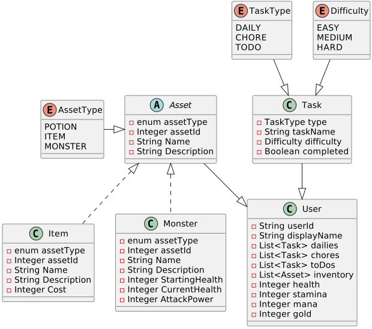
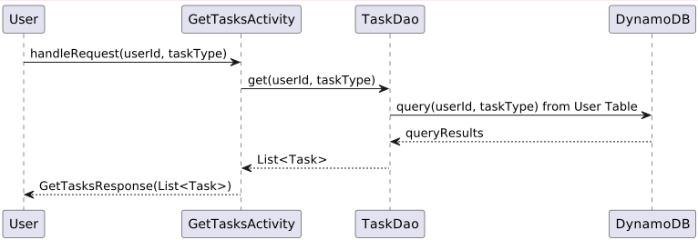

# TASK WARRIOR

### Problem Statement
I start every day with a to-do list, in the past I have used apps to track my progress but none of them have enough incentive to keep me around for very long versus pen and paper. My goal is to create a gamified to-do list that includes routine tasks that you do every day (dailies), chores that you do every once and a while but repeatedly (chores), and unique one off tasks that disappear once completed (To-Dos). On completion of a task, the user randomly receives an amount of gold that they can use to buy items to restore stamina, health, and mana bars. These bars are used in combat to defeat creatures and level up.

### User Stories
1. As a user, I need to create a task and assign it to Dailies, Chores, or To-Dos.
2. As a user, I need to mark a task as completed for the day. 
3. As a user, I want to update a task to change name or difficulty, or assign to a different category.
4. As a user, I want to delete tasks that aren't relevant anymore.
5. As a user, I want to start a new day manually to reset tasks.
6. As a user, I want to spend gold at the store to get items.
7. As a user, I want to see items in my inventory with descriptions.
8. As a user, I want to spend stamina to attack monsters.
9. As a user, I want to spend mana to use magic. 
10. As a user, I need to save my data.
11. As a user, I want to change my display name.

### Stretch Goals
1. As a user, I want to have different attacks to choose from.
2. As a user, I want multiple spells to choose from.
3. As a user, I want multiple potions with different effects.
4. As a user, I want to see animations of the attacks.
5. As a user, I want to gain EXP which allows for more moves.
6. As a user, I want the day to reset at a set UTC time.

### UML Diagram


## Tables

### User Table
| UserId (Partition Key) | displayName | dailies      | chores       | todos        | inventory    | stats                                    |
|------------------------|-------------|--------------|--------------|--------------|--------------|------------------------------------------| 
| String                 | String      | String(json) | String(json) | String(json) | String(json) | Number Set (health, stamina, mana, gold) |

### Assets Table
| assetType (Partition Key) (GSI key) | assetId (Sort Key) | name | description | healthOrCost (GSI Key) |
|-------------------------------------|-------------|--------------|--------------|------------------------|
| String (Potion, Monster, Item)      | Number (unique per assetType) | String | String | Number                 |
*HealthOrCost as a GSI Key allows to getting Monsters of a certain health or items that are affordable to the user.*

# API
## API Interactable Objects
### User Object
- UserId (String) (not changable)
- DisplayName (String) (changable)
- Dailies (List of Tasks)
- Chores (List of Tasks)
- ToDos (List of Tasks)
- Inventory (List of Assets)
- Health (Integer)
- Stamina (Integer)
- Mana (Integer)
- Gold (Integer)

### Task Object
- TaskType (enum of DAILY, CHORE, TODO)
- TaskName
- Difficulty (enum of EASY, MEDIUM, HARD)
- Completed (Boolean)

### Asset Object
- AssetType (String)
- AssetId (Integer)
- Name (String)
- Description (String)

### Item Object inherits from Asset
- AssetType (String) 
- AssetId (Integer)
- Name (String)
- Description (String)
- Cost (Integer)

### Monster Object inherits from Asset
- AssetType (String)
- AssetId (Integer)
- Name (String)
- Description (String)
- StartingHealth (Integer)
- CurrentHealth (Integer)
- AttackPower (Integer)

## API Endpoints

## Post Endpoints
## CreateUserLambda
Creates a new user in the User table with blank data.
### CreateUserRequest
```
userId // userId from Login to create save data for
```
### CreateUserResponse
```
user // object with default data returned from creation
```

## CreateAssetLambda
Creates a new asset in the Asset table with correct data.
### CreateAssetRequest
```
assetType // enum of POTION, ITEM, MONSTER
assetId // unique identifier within each Type
name // String of the name 
description // String of the description of the asset
healthOrCost // Integer of either the cost or health of asset
```
### CreateAssetResponse
```
asset // either an item or monster object that was created from the request
```

## CreateTaskLambda
Creates a new task and saves it within existing user.
### CreateTaskRequest
```
taskType // enum of DAILY, CHORE, TODO
taskName // String of the name 
difficulty // enum of EASY, MEDIUM, HARD
```
### CreateTaskResponse
```
task // the task that was created
```

# Put Endpoints

## UpdateUserLambda
Updates the user table with new user data.
### UpdateUserRequest
```
user // the user object that we need to update in the table
```
### UpdateUserResponse
```
user // the updated user object
```

## UpdateTaskLambda
Updates the user table with new task data.
### UpdateTaskRequest
```
user // the user object that we need to update in the table
task  // the task object that is going to be updated
name // new name if name is being updated, optional
difficulty // new difficulty if difficulty is being updated, optional
completed // new boolean if completed is being updated, optional
```
### UpdateTaskResponse
```
user // the updated user object
```

# Get Endpoints

## GetUserLambda
Gets the user from the user table.
### GetUserRequest
```
userId // the userId that is used at the table key.
```
### GetUserResponse
```
user // the user object requested
```

## GetUserInventoryLambda
Gets the user's inventory from the user table.
### GetUserRequest
```
userId // the userId that is used at the table key.
```
### GetUserResponse
```
items // List<Assets> of user inventory
```

## GetTasksLambda
Gets the requested tasks from the user table.
### GetTasksRequest
```
userId // the userId that is used at the table key.
taskType // enum of DAILY, CHORE, or TODO
```
### GetTasksResponse
```
tasks // list<tasks> from the table
```

## GetSpecificAssetLambda
Gets the requested asset from the asset table.
### GetSpecificAssetRequest
```
assetType // enum of POTION, ITEM, or MONSTER
assetId // unique id of the asset
```
### GetSpecificAssetResponse
```
asset // the specific asset that was requested
```

## GetAllOfAssetTypeLambda
Gets the requested assets of a certain type from the asset table.
### GetAllOfAssetTypeRequest
```
assetType // enum of POTION, ITEM, or MONSTER
assetType2 // optional second enum (for the shop to get all potions and items)
```
### GetAllOfAssetTypeResponse
```
assetList // a list of all assets of a certain type
```

# Delete Endpoints
## DeleteTaskLambda
Deletes the task from the user's task list, then saves user data without task. Throws error if task doesn't exist.
### DeleteTaskRequest
```
userId // userId for the table to check
taskType // enum of DAILY, CHORE, or TODO
taskName // name of the task to delete
```
### DeleteTaskResponse
```
task // the deleted task
```

## Sequence Diagram

*Walkthrough of the GetTasksLambda Sequence Diagram*

## Mockup

*Concept art for the Frontend application*